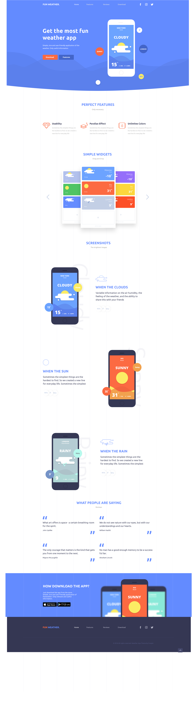

#Demo Weather APP landing Page
This is my second project. I'm still learning more and more about structuring CSS and BEM model. The concept of code "quality" is now obviouse to me. 

This design is based on a the free PSD provided by [Bionocopy](https://gumroad.com/bionocopy)
He was humble enough to share this for free online. 

Below you can find the exported png from the PSD he provided. I used the PSD as refernece and tried to bring it to life by adding the parallax effect. 

